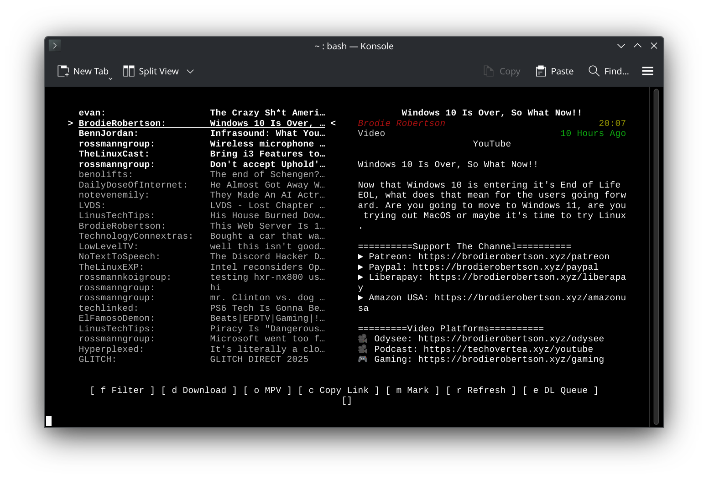

# YouTube Helper Client

This is an official TUI implementation of a client for the [YouTube Helper server](https://git.oirnoir.dev/OIRNOIR/YouTube-Helper-Server).



This is a simple self-hosted client/server setup for YouTube subscriptions.

This project started in July 2025 because I got tired of using YouTube's official UI.
To make this client useful, you need a matching server with your subscriptions setup.

---

## Installation: Linux and macOS

This assumes you have a basic understanding of the CLI and already have a server setup.

1. Clone this repository into a directory somewhere on your local machine, then cd to it in a terminal.

2. Install dependencies:
    - [Deno](https://deno.com/)
    - [yt-dlp](https://github.com/yt-dlp/yt-dlp/)
    - [FFmpeg](https://ffmpeg.org/)

3. Install Deno packages:
    - `deno install`

4. Create config file
    - `cp config.json.example config.json`
    - Edit `config.json`
    - Replace `INSERT_AUTHORIZATION_TOKEN_HERE` with the auth token you set for your server
    - Replace `INSERT_HOSTNAME_HERE` with the hostname your server is listening on

## Running

Start the client with:

```bash
deno run ./src/index.ts
```

If you wish to set an alias for this command (for instance, if you wish to alias the command `yt` to
running this program), you can add an alias to your .bashrc or equivalent:

```bash
alias yt="deno run /path/to/YouTube-Helper-Client/src/index.ts"
```

## Features

- Download videos: `d`
- Filter subscriptions: `f`
- Open in MPV (requires installing MPV media player): `o`
- Copy Link: `c`
- Mark Unread/Read: `m`
- Download Queue: `e`
    - Downloads can be retried
    - "Retry w/ cookie" uses the cookies from the browser specified in config.json, see yt-dlp documentation
- Search (Beta, searches through subscriptions): `/`
- Jump to top: `gg`
- Native SponsorBlock integration for full-video segments

## Contributing

Official development for this program, including test running, etc. happens on a [Forgejo instance](https://git.oirnoir.dev/OIRNOIR/YouTube-Helper-Client)
which is not open to public account-creation.

Instead, contributions may be proposed (and issues reported) on [Codeberg](https://codeberg.org/OIRNOIR/YouTube-Helper-Client). Please be aware
that this Codeberg repo does not support automated CI. You should ensure that your code compiles and is correctly styled
before opening a pull request:

- Run `deno run lint` to format the code and ensure it is free of certain code smells. There should be no errors.
- Run `deno run typecheck` to ensure that the TypeScript compiles completely. There should be no errors.

AI-generated contributions will not be accepted.
